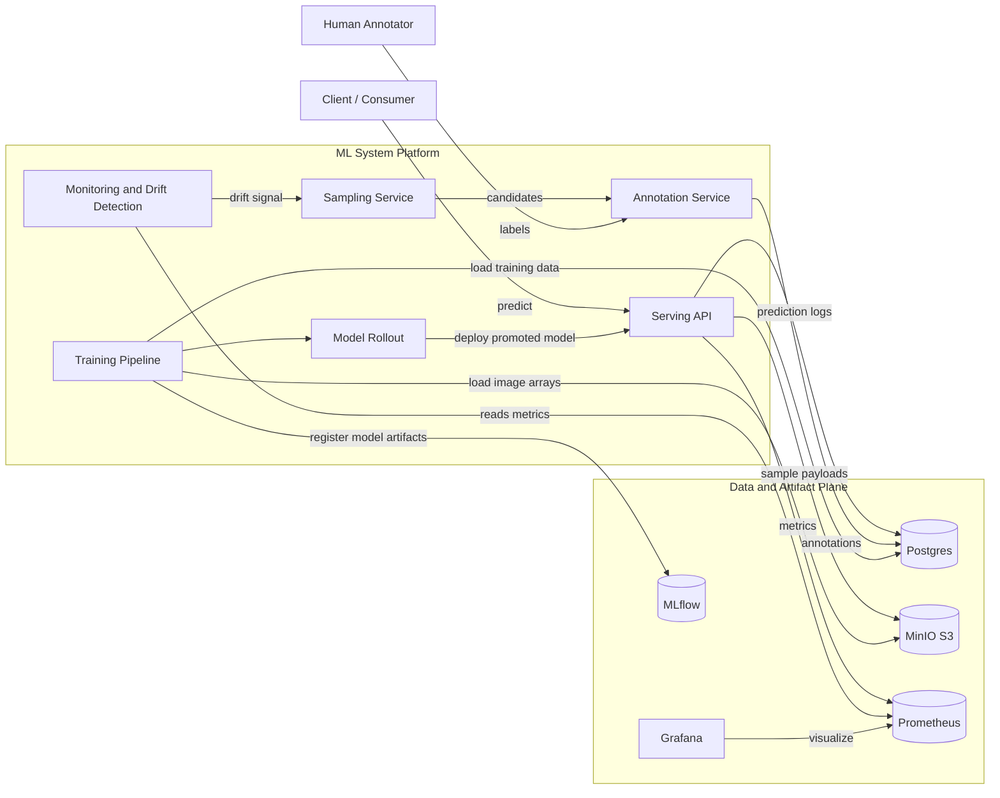

# Architecture

## C4 Level 1: System Context

This level describes the system at high level: primary users, external systems, and the core MLOps platform boundary.

The `ml-system` platform serves model predictions and continuously adapts through monitoring, annotation, retraining, and rollout.

## Scope and Intent

- Primary purpose: local-first MLOps experimentation with production-like control loops.
- Main user interaction: prediction requests to serving and operational monitoring via dashboards.
- Core feedback loop: drift detection -> annotation -> retraining -> model rollout.

## Next Levels

- C4 Level 2 (Container): service boundaries, protocols, and runtime responsibilities.
- C4 Level 3 (Component): internals of key services such as Serving, Data Controller, and Training.
