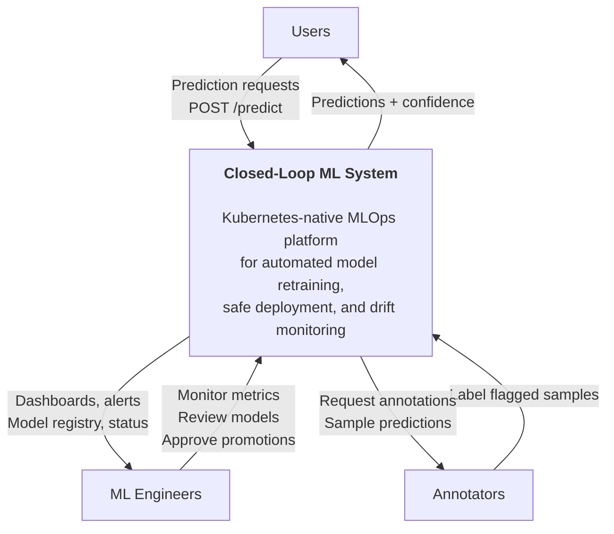
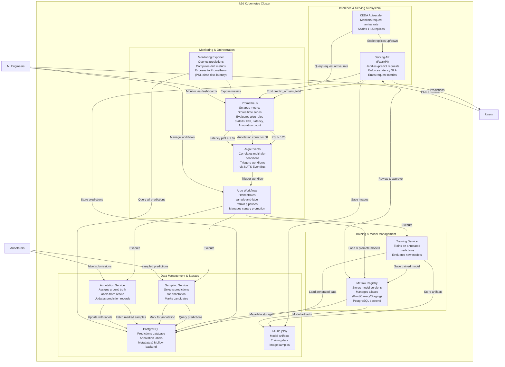

# C4 Architecture Model

## System Overview

The **ML System** is an end-to-end MLOps platform designed for learning production ML patterns in a local Kubernetes environment. It implements a closed-loop learning system: serve predictions → monitor for drift → detect data distribution shifts and anomalies → trigger retraining automatically → deploy updated models via canary rollout → scale based on demand. The system prioritizes pragmatism and local parity with production deployments.

**Key Purpose:**
- Serve MNIST predictions with low latency constraints (p99 < 1.0s)
- Detect batch drift via PSI (Population Stability Index) on class distributions
- Collect human annotations on flagged predictions to improve model performance
- Trigger automated retraining when data coverage and drift thresholds are met
- Perform safe canary deployments to validate new models before full rollout
- Auto-scale serving capacity based on real-time request arrival rate

---

## Level 1: System Context

---

## Level 2: Container Diagram (Major Subsystems)

---

## Subsystem Descriptions

### Inference & Serving Subsystem
Handles real-time prediction requests from users. The Serving API receives images via REST and returns predictions with confidence scores. KEDA monitors request arrival rates and auto-scales serving pods (1–15 replicas) to maintain performance under load. Metrics (predict_arrivals_total) are emitted to Prometheus for scaling decisions.

### Training & Model Management
Manages the model lifecycle. The Training Service operates on-demand (triggered by Argo Workflows) to retrain models on newly annotated data. MLflow maintains a model registry with version control and alias management (Production for stable, Canary for validation). Models are stored as ONNX artifacts with reference distributions for drift detection.

### Data Management & Storage
Persistent storage layer. PostgreSQL holds prediction records with metadata, annotation labels, and MLflow backend state. MinIO (S3-compatible) stores model artifacts, training data, and image samples. The Sampling Service marks predictions for human annotation; the Annotation Service assigns ground truth labels from an oracle, simulating the feedback loop.

### Monitoring & Orchestration
Implements event-driven retraining logic. Prometheus scrapes metrics (drift PSI, latency, confidence) and evaluates 3 alert rules. Argo Events correlates multi-condition alerts (e.g., drift + data availability) via NATS EventBus and triggers Argo Workflows. Workflows orchestrate the data sampling → annotation → retraining → canary promotion pipeline. The Monitoring Exporter continuously computes drift metrics and exposes them for alerting.

---

## Key Flows

- **Inference Flow**: User → Serving API → PostgreSQL (store) + Prometheus (metrics) → Response
- **Drift Detection**: Monitoring Exporter → Queries predictions → Computes PSI → Prometheus → Alert → Argo Events → Workflow
- **Retraining**: Alert triggers → Argo Workflows → Sampling → Annotation → Training → MLflow (new version) → Canary promotion
- **Autoscaling**: KEDA → Queries predict_arrivals_total → Scales Serving replicas based on RPS target (5 per replica)

