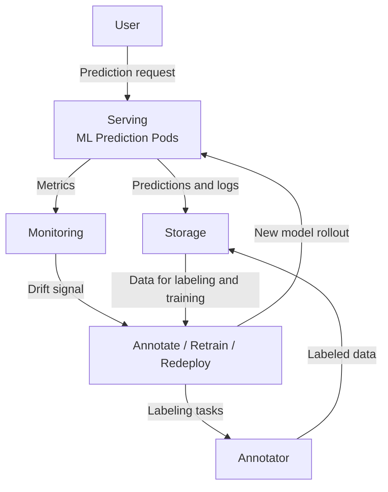

# ML System Overview

## What this system is

A closed-loop ML system that runs locally but uses production-grade technologies and patterns. The system implements a complete feedback loop: serve predictions on live data, monitor for distribution shift, collect labels, retrain the model when conditions are met, validate against current production, and deploy with automated safeguards.

## System behavior

1. **Prediction serving**: The model processes incoming requests, returns responses and logs prediction events.

2. **Drift detection**: Monitoring service computes Population Stability Index (PSI) on recent prediction distributions. When PSI exceeds threshold (0.25), a drift alert is issued.

3. **Annotation availability**: When sufficient labeled predictions accumulate (50+), an annotation-ready alert is issued.

4. **Conditional retraining trigger**: When both drift and annotation-ready alerts have fired, retraining begins automatically:
   - Integrate newly labeled predictions into dataset
   - Train candidate model on updated data  
   - Evaluate candidate against currently deployed model
   - If candidate outperforms current: canary rollout with gradual traffic migration
   - Otherwise: reject candidate and retain current model

5. **Dynamic scaling**: Serving deployment adjusts replica count based on request arrival rate.

## System architecture

