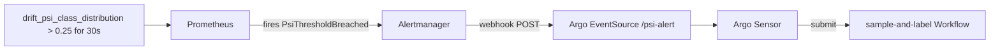

# PSI Alert → Argo Workflow Pipeline

This document describes the end-to-end pipeline that triggers automated annotation
whenever model drift is detected: from Prometheus firing a PSI alert, through
AlertManager and Argo Events, to an Argo Workflow running the annotation service.

---

## Overview



```
drift_psi_class_distribution > 0.25 for 30s
  → Prometheus fires PsiThresholdBreached
  → AlertManager POSTs webhook
  → Argo Events EventSource receives POST
  → Argo Events Sensor submits Workflow
  → sample-and-label Workflow runs annotation service
```

**Namespace layout:**

| Component | Namespace |
|---|---|
| Argo Workflows controller + UI | `argo` |
| Argo Events controller | `argo-events` |
| EventBus, EventSource, Sensor | `ml-system` |
| WorkflowTemplate, submitted Workflows | `argo` |
| Prometheus, AlertManager, Grafana | `ml-system` |

The namespace split is intentional. Argo infrastructure is shared and namespace-agnostic;
your application's event wiring lives in `ml-system`; submitted Workflows land in `argo`
so the Argo UI has a single namespace to watch.

---

## Services Involved

### Prometheus
Evaluates the PSI metric every 15s. When `drift_psi_class_distribution > 0.25` holds for
30 seconds, it transitions the alert from `pending` to `firing` and forwards it to
AlertManager.

**Alert rule** (`helm/ml-system/templates/prometheus.yaml`):
```yaml
- alert: PsiThresholdBreached
  expr: drift_psi_class_distribution > 0.25
  for: 30s
  labels:
    severity: warning
  annotations:
    summary: "PSI class distribution exceeds 0.25 — drift detected"
```

**Alerting target** (same file):
```yaml
alerting:
  alertmanagers:
    - static_configs:
        - targets:
            - alertmanager.ml-system.svc.cluster.local:9093
```

### AlertManager
Receives the alert from Prometheus and routes it to the Argo Events webhook.
The `repeat_interval: 1m` ensures it re-sends the webhook every minute while the
alert remains active (default would be 4 hours).

**Config** (`helm/ml-system/templates/alertmanager.yaml`):
```yaml
route:
  receiver: 'default'
  routes:
    - match:
        alertname: PsiThresholdBreached
      receiver: 'argo-events-webhook'
      repeat_interval: 1m
receivers:
  - name: 'default'
  - name: 'argo-events-webhook'
    webhook_configs:
      - url: 'http://psi-alert-eventsource-svc.ml-system.svc.cluster.local:12000/psi-alert'
        send_resolved: false
```

### Argo Events EventSource
A webhook server listening on port 12000 at `/psi-alert`. AlertManager POSTs to this
endpoint. The `psi-alert-eventsource-svc` Kubernetes Service routes traffic to the
EventSource pod.

### Argo Events Sensor
Watches the EventSource for new events. On each event, submits a Workflow to the `argo`
namespace using the `sample-and-label` WorkflowTemplate. Runs under `argo-events-sa`,
which has ClusterRole permissions to submit workflows cross-namespace.

### sample-and-label WorkflowTemplate
Runs the annotation service (`ml-system-annotation:latest`) inside the `argo` namespace.
Fetches up to `ANNOTATION_SAMPLES_PER_RUN` candidate predictions from Postgres and writes
ground-truth labels back. The batch is naturally capped at the number of unannotated rows.

---

## Setup

This pipeline is fully automated by `make k3d.bootstrap`. If you are setting up from
scratch, the bootstrap handles everything. This section documents what each step installs
in case you need to reproduce or debug individual components.

### 1. Cluster with correct port mappings

The Argo Workflows UI is exposed on port 2746 via a k3d NodePort mapping. **This mapping
must exist at cluster creation time** — k3d port mappings are immutable after the cluster
is created.

```bash
make k3d.create
```

This includes `--port "2746:30007@server:0"` which forwards `localhost:2746` → NodePort
30007 inside the cluster.

If the cluster already exists without this port, you must recreate it:
```bash
make k3d.delete
make k3d.bootstrap
```

### 2. Install Argo Workflows and Argo Events

```bash
make k3d.argo.install
```

This runs:
```bash
# Argo Workflows — UI exposed as NodePort 30007
helm upgrade --install argo-workflows argo/argo-workflows \
  --namespace argo --create-namespace \
  --set "server.authModes={server}" \
  --set server.serviceType=NodePort \
  --set server.serviceNodePort=30007 \
  --wait

# Argo Events controller — cluster-wide, installs CRDs
helm upgrade --install argo-events argo/argo-events \
  --namespace argo-events --create-namespace \
  --set crds.install=true \
  --wait
```

`k3d.argo.install` is step 3 of `k3d.bootstrap` — it runs automatically during full setup.

### 3. Deploy the Helm chart and Argo Events resources

```bash
make k3d.deploy
```

This does two things:

**Helm upgrade** — deploys `ml-system` chart which includes:
- AlertManager (Deployment + Service + ConfigMap)
- `argo-events-sa` ServiceAccount in `ml-system`
- `argo-events-workflow-submitter` ClusterRole + ClusterRoleBinding
- Prometheus alerting config and `PsiThresholdBreached` rule

**kubectl SSA apply** — applies `k8s/argo/argo-events-resources.yaml` with server-side apply:
```bash
kubectl apply --server-side --force-conflicts -f k8s/argo/argo-events-resources.yaml
```

This file is applied outside Helm because the Argo Events controller uses Server-Side Apply
to manage `.spec.triggers` on the Sensor resource. This conflicts with Helm's client-side
apply on subsequent upgrades and causes `UPGRADE FAILED: conflict` errors.

The file contains:
- `EventBus` (NATS, 1 replica) — messaging backbone required by Argo Events
- `EventSource` (webhook, port 12000, `/psi-alert`) — receives AlertManager POSTs
- `Service` `psi-alert-eventsource-svc` — routes to the EventSource pod
- `Sensor` `psi-alert-sensor` — submits Workflow on each event
- `WorkflowTemplate` `sample-and-label` (in `argo` namespace)
- `Role` + `RoleBinding` for `workflowtaskresults` in `argo` namespace (required by Argo emissary executor)

### 4. Import the annotation image into k3d

The annotation service image is built and imported locally — it is never pulled from a
registry. This must be done before any workflow runs.

```bash
docker build -t ml-system-annotation:latest -f annotation/Dockerfile .
k3d image import ml-system-annotation:latest -c ml-system
```

`make k3d.build` and `make k3d.import` handle this as steps 4 and 5 of `k3d.bootstrap`.

---

## Verification

Work through these checks in order to confirm each link in the chain.

### Check 1 — All pods running

```bash
make k3d.status
```

Confirm pods are `Running` in `ml-system`, `argo`, and `argo-events` namespaces.
In particular:
- `alertmanager-*` in `ml-system`
- `psi-alert-eventsource-*` in `ml-system`
- `psi-alert-sensor-*` in `ml-system`
- `eventbus-default-stan-*` (3 pods) in `ml-system`
- `argo-workflows-server-*` in `argo`
- `argo-workflows-workflow-controller-*` in `argo`

The EventBus creates 3 NATS pods regardless of `replicas: 1` — NATS enforces a minimum
of 3 for clustering. Each pod runs 2 containers (the NATS server + a metrics sidecar),
which is expected.

### Check 2 — Prometheus alert visible

Open `http://localhost:9090/alerts` and confirm `PsiThresholdBreached` appears.

To force the alert to fire, run the drift simulation:
```bash
make serve.test.drift INVERSION_PROB=1.0 DURATION=120 RATE=10
```

After ~30 seconds the alert transitions from `pending` to `firing`.

### Check 3 — AlertManager routing

Open `http://localhost:9090` → Status → Runtime & Build Information → verify
AlertManager target is listed under `alertmanagers`.

Check AlertManager logs for successful webhook delivery:
```bash
kubectl logs deployment/alertmanager -n ml-system | grep -i notify
```

A successful delivery looks like:
```
level=info ... msg="Notify success" receiver=argo-events-webhook
```

### Check 4 — EventSource receiving POSTs

```bash
kubectl logs deployment/psi-alert-eventsource -n ml-system | tail -20
```

Look for `200` responses on `/psi-alert` POST requests. You can also test the endpoint
manually without waiting for an alert:
```bash
kubectl run curl-test --image=curlimages/curl --restart=Never --rm -it -- \
  curl -s -X POST \
  http://psi-alert-eventsource-svc.ml-system.svc.cluster.local:12000/psi-alert \
  -H "Content-Type: application/json" \
  -d '{"test": true}'
```

### Check 5 — Sensor submitting workflows

```bash
kubectl logs deployment/psi-alert-sensor -n ml-system | tail -20
```

Look for:
```
Successfully processed trigger ... triggerName=trigger-sample-and-label
```

### Check 6 — Workflow created and completed

```bash
kubectl get workflows -n argo
```

Expected output:
```
NAME                    STATUS      AGE
sample-and-label-xxxxx  Succeeded   2m
```

You can also inspect via the Argo UI at `http://localhost:2746`.

### Check 7 — Grafana annotation and panel

Open Grafana at `http://localhost:3000` (admin / admin) → ML System dashboard.

- **Red vertical line**: appears on the PSI panel at the moment the alert fired.
  Driven by the `PSI Alert` annotation: `ALERTS{alertname="PsiThresholdBreached",alertstate="firing"}`.
- **Alert & Workflow State panel**: shows two step-function series:
  - `PSI Alert Active` — rises to 1 when alert fires
  - `Workflows Running` — rises when the Argo workflow is scheduled

The time gap between the two rising edges is the end-to-end pipeline latency (~10–20s
in normal conditions).

---

## Re-deploying After Config Changes

When you change AlertManager config or Prometheus alert rules:

```bash
make k3d.deploy
```

Prometheus and AlertManager read their config from ConfigMaps at startup — a config
change requires a pod restart:

```bash
kubectl rollout restart deployment/alertmanager -n ml-system
kubectl rollout restart deployment/prometheus -n ml-system
```

> **Note:** Prometheus uses a `ReadWriteOnce` PVC. If the rollout restart hangs with
> `CrashLoopBackOff`, the old pod still holds the PVC lock. Delete it manually:
> ```bash
> kubectl delete pod -l app=prometheus -n ml-system
> ```

When you change `k8s/argo/argo-events-resources.yaml` (EventBus, EventSource, Sensor,
WorkflowTemplate), apply directly with SSA — do not use `kubectl apply` without
`--server-side`:

```bash
kubectl apply --server-side --force-conflicts -f k8s/argo/argo-events-resources.yaml
```

---

## Troubleshooting

| Symptom | Likely cause | Fix |
|---|---|---|
| Alert fires in Prometheus but AlertManager shows no activity | AlertManager pod has old config (no `alerting:` block in prometheus.yml) | `make k3d.deploy && kubectl rollout restart deployment/alertmanager -n ml-system` |
| AlertManager logs show `Notify success` but no workflow created | `psi-alert-eventsource-svc` Service missing | Check `kubectl get svc -n ml-system`; re-apply `k8s/argo/argo-events-resources.yaml` |
| Workflow created but fails with `workflowtaskresults is forbidden` | Missing RBAC for emissary executor | Re-apply `k8s/argo/argo-events-resources.yaml` — contains Role + RoleBinding in `argo` namespace |
| Workflow fails with `failed to look-up entrypoint/cmd for image` | Image not imported into k3d or missing `command:` in WorkflowTemplate | Run `k3d image import ml-system-annotation:latest -c ml-system`; confirm `command: [python, -m, annotation.main]` in WorkflowTemplate |
| Sensor logs show repeated errors on restart | NATS replays unacknowledged messages from previous session | Expected behavior; errors clear once Sensor reconnects and acknowledges backlog |
| `helm upgrade` fails with `conflict: ... owns field .spec.triggers` | Argo Events SSA conflict | Use `kubectl apply --server-side --force-conflicts` for `k8s/argo/argo-events-resources.yaml` instead of Helm |
| Grafana annotation says "Datasource prometheus was not found" | Grafana datasource provisioning missing `uid: prometheus` | Datasource ConfigMap in `grafana.yaml` must include `uid: prometheus` |
| Alert visible in Prometheus but workflow not triggered after >5 min | AlertManager `repeat_interval` default (4h) not overridden | Confirm `repeat_interval: 1m` is set in the alertmanager ConfigMap route; redeploy and restart AlertManager |
