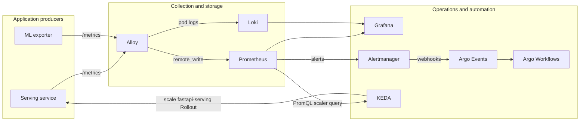
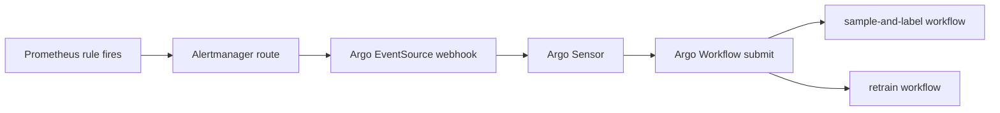

# Monitoring and Observability

This page documents the monitoring stack as implemented today, including metrics, logs, alert-driven automation, and autoscaling.

## Objectives

- Observe serving traffic, latency, and model behavior.
- Detect drift and annotation readiness for retraining.
- Route logs centrally for investigation.
- Trigger operational workflows automatically from alerts.
- Scale serving based on incoming load.

## Architecture overview

## Logging model and facade boundary

Services use the shared logging facade in `shared/logging_config.py` through `setup_logging(service)`.

What the facade centralizes:

- Root log level from `LOG_LEVEL`.
- Console formatting and handler setup.
- Optional Loki shipping when `LOKI_URL` is set.
- Service label tagging for log streams.

Operationally, Alloy also collects Kubernetes pod logs and sends them to Loki. This gives centralized logs even when a service only logs to stdout.

Design boundary:

- Business logic in services does not depend on Alloy internals.
- Services only depend on the logging facade contract and standard Python logging.
- Log transport backends can be swapped by changing the facade and infrastructure wiring, not serving/training business code.

## Metrics producers

### Serving metrics

Serving publishes request/inference telemetry on `/metrics`, including:

- Arrival rate signal: `predict_arrivals_total` (stable/canary labels).
- Inference output counters: `prediction_class_total`.
- Confidence histograms: `prediction_confidence_score`.
- Mahalanobis score histograms: `prediction_mahalanobis_score`.
- FastAPI/HTTP instrumentation metrics.

Notes:

- Arrival metrics are incremented before request concurrency gating so autoscaling sees true inbound pressure.
- Serving role labels (`stable` / `canary`) are used for rollout-aware monitoring.

### ML exporter metrics

ML exporter publishes drift/annotation pipeline telemetry on `/metrics`, including:

- Drift PSI: `drift_psi_class_distribution{role="stable|canary"}`.
- Window sample count and class frequencies.
- Mean confidence in current window.
- Last successful poll age.
- Annotated backlog for retraining readiness: `annotation_annotated_count`.

PSI semantics:

- PSI is emitted against reference distributions from model artifacts.
- When the window is too small, a sentinel value is emitted instead of a valid PSI.

## Collection and storage path

### Metrics path

- Alloy scrapes serving pods directly (pod discovery) to avoid service-level round-robin scrape artifacts.
- Alloy scrapes ml-exporter and Argo Workflows controller metrics.
- Alloy forwards metrics to Prometheus via remote write.
- Prometheus evaluates rules and exposes query APIs for Grafana and KEDA.

### Logs path

- Alloy discovers pods in the namespace and tails pod logs.
- Alloy forwards logs to Loki.
- Grafana uses Loki datasource for log exploration and correlation with metrics.

## Dashboards

Grafana is provisioned with:

- Prometheus datasource.
- Loki datasource.
- Preloaded ML System dashboard.

The dashboard includes request rate, active pods, PSI trends, and alert annotations.

## Alerts and workflow automation

Prometheus rules include at least:

- `HighLatency`
- `PsiThresholdBreached`
- `AnnotationCountReached`

Alertmanager routes alert webhooks to Argo Events event sources.

Argo Events sensors submit workflows for:

- Sampling + annotation when PSI threshold breaches.
- Retraining when both drift and annotation readiness conditions are met.

### Alert automation graph

## Autoscaling

KEDA scales the serving Argo Rollout using Prometheus query results:

- Metric query: `sum(rate(predict_arrivals_total[window]))`
- Target: requests per second per replica
- Scale target: `fastapi-serving` Rollout
- Tuned policies for scale up and scale down windows

This keeps scaling tied to incoming request pressure, not only completed throughput.

## Replaceability summary

Infrastructure components are intentionally replaceable behind stable boundaries:

- App code emits metrics and logs through standard interfaces.
- Logging facade hides log transport details from service logic.
- Alloy handles discovery/collection/routing concerns.
- Prometheus/Loki/Grafana can be swapped with bounded changes at the infra and facade layers.

## Operational checks

Quick checks to confirm monitoring is healthy:

- Serving and ml-exporter `/metrics` endpoints respond.
- Alloy is scraping both targets and forwarding data.
- Prometheus has recent samples for serving and drift metrics.
- Grafana dashboard panels update in expected intervals.
- Loki receives logs with service labels.
- Alert test path reaches Argo workflow submission.
- KEDA scaler observes `predict_arrivals_total` and adjusts replicas.
